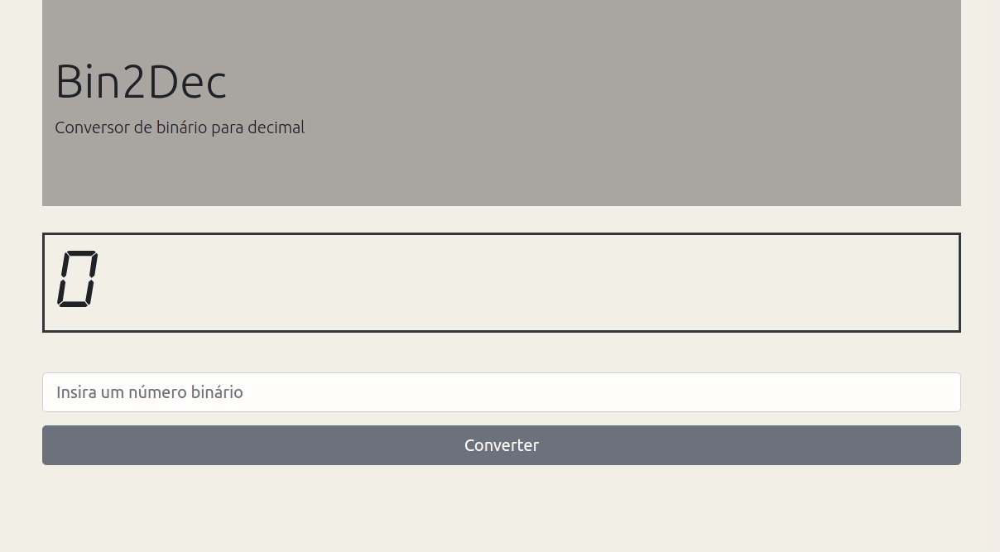

# Bin2Dec

**Nível:** 1-Iniciante

Binário é o sistema numérico no qual todos os computadores digitais são baseados. Portanto, é importante para os desenvolvedores entender a matemática binária ou base 2. O objetivo do Bin2dec é fornecer prática e compreensão de como são feitos cálculos binários.

Bin2dec permite ao usuário inserir strings de até 8 dígitos binários, 0’s
e 1’s, em qualquer sequência e, em seguida, exibe o seu equivalente decimal.

Este desafio requer que o desenvolvedor que o está implementando siga estas restrições:

- Arrays não podem ser usados para conter os dígitos binários inseridos pelo usuário
- A determinação do equivalente decimal de um determinado dígito binário na sequência deve ser calculada utilizando uma única função matemática, por exemplo, o logaritmo natural. Cabe a você descobrir qual função usar.

## Histórias de usuário

- [X] O usuário pode inserir até 8 dígitos binários em um campo de entrada
- [X] O usuário deve ser notificado se qualquer coisa que não seja um 0 ou 1 foi inserido
- [X] O usuário visualiza os resultados em um único campo de saída contendo o equivalente decimal (base 10) do número binário que foi digitado

## Recursos bônus

- [X] O usuário pode introduzir um número variável de dígitos binários

## Links e recursos úteis

[Binary number system](https://en.wikipedia.org/wiki/Binary_number)

## My App

### [bin2dec](https://lucasmartins96.github.io/bin2dec/)

#### [retornar ao my-app-ideas](https://github.com/lucasmartins96/my-app-ideas/tree/main/beginner)
<!-- ## Example projects

Try not to view this until you've developed your own solution:

- [Binary to decimal conversion program for beginners](https://www.youtube.com/watch?v=YMIALQE26KQ)
- [Binary to Decimal converter using React](https://github.com/email2vimalraj/Bin2Dec)
- [Binary to Decimal converter with plain html, js and css](https://grfreire.github.io/Bin2Dec/)
- [Binary to Decimal converter using Flutter & Dart](https://github.com/israelss/AppIdeasCollection/tree/master/Tier1/Bin2Dec)
  - [Live preview built with Flutter for Web](https://bin2dec.web.app/#/)
- [Binary to Decimal converter using React](https://github.com/geoffctn/Bin2Dec)
- [Matrix-like Binary to Decimal converter using Angular](https://github.com/ZangiefWins/MatrixBin2Dec)
  - [Live preview on heroku](https://matrix-bin2dec.herokuapp.com/) -->
